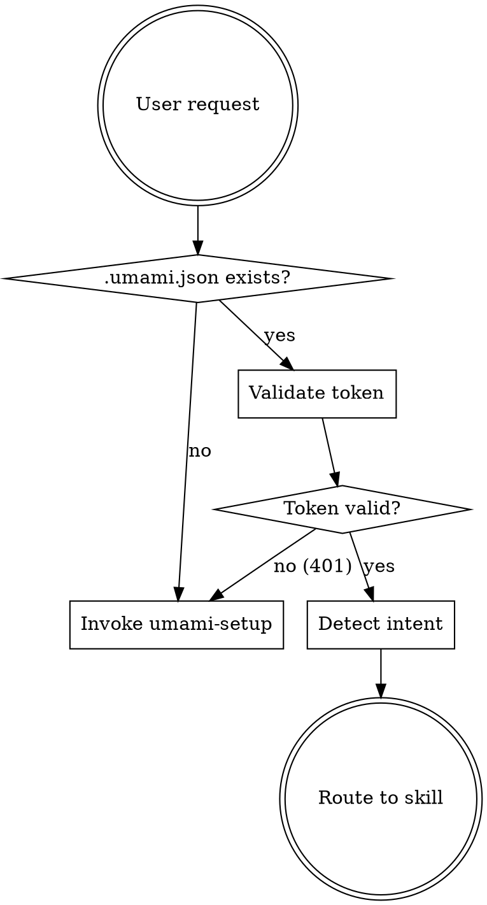

# Umami Analytics Skills Suite — Implementation Plan

> **For agentic workers:** REQUIRED: Use superpowers:subagent-driven-development (if subagents available) or superpowers:executing-plans to implement this plan. Steps use checkbox (`- [ ]`) syntax for tracking.

**Goal:** Build 5 Claude Code skills for comprehensive Umami Analytics integration (hub router + setup + tracking + reports + query).

**Architecture:** Skills are markdown files in `plugins/bvdr/commands/`. Each skill instructs Claude how to perform Umami operations — setup writes `.umami.json` config, tracking analyzes codebases and implements events, reports creates/runs reports via API, query fetches stats. Hub skill routes to the right sub-skill.

**Tech Stack:** Markdown skill files, Bash (curl for API calls), jq (JSON parsing), Umami REST API

**Spec:** `docs/superpowers/specs/2026-03-11-umami-analytics-skills-design.md`

---

## Chunk 1: Foundation Skills (Setup + Hub)

### Task 1: Create `umami-setup.md` skill

**Files:**
- Create: `plugins/bvdr/commands/umami-setup.md`

- [ ] **Step 1: Write the skill file**

Create `plugins/bvdr/commands/umami-setup.md` with this content:

```markdown
---
description: Use when setting up Umami Analytics for a project, connecting to an Umami instance, installing the tracker script, or verifying an existing connection.
---

# Umami Setup

Configure a project to use Umami Analytics. Handles authentication, website selection, script tag installation, and connection verification.

## Flow

1. Check if `.umami.json` exists at project root
   - If exists → offer re-run options (see below)
   - If not → proceed with setup

2. Collect connection details using AskUserQuestion:
   - Umami host URL (e.g., `https://analytics.mysite.com`)
   - Username
   - Password

3. Authenticate against the Umami instance:

```bash
curl -s -X POST "{host}/api/auth/login" \
  -H "Content-Type: application/json" \
  -d '{"username": "{username}", "password": "{password}"}'
```

Response: `{ "token": "eyT...", "user": { "id": "...", "username": "...", "role": "...", "isAdmin": true } }`

If authentication fails, show the error and ask the user to check their credentials.

4. List available websites:

```bash
curl -s "{host}/api/websites" \
  -H "Authorization: Bearer {token}"
```

Present the list to the user and let them pick one. If they want to create a new website, confirm first then:

```bash
curl -s -X POST "{host}/api/websites" \
  -H "Authorization: Bearer {token}" \
  -H "Content-Type: application/json" \
  -d '{"name": "{name}", "domain": "{domain}"}'
```

5. Write `.umami.json` to project root:

```json
{
  "host": "https://analytics.mysite.com",
  "websiteId": "94db1cb1-74f4-4a40-ad6c-962362670409",
  "token": "eyTxxxxx...",
  "domain": "mysite.com"
}
```

6. Add `.umami.json` to `.gitignore`:
   - If `.gitignore` doesn't exist → create it with `.umami.json`
   - If `.gitignore` exists but doesn't contain `.umami.json` → append it
   - If already listed → skip

7. Detect project framework and install the tracker script tag:

   **Next.js (app router):** Add to `app/layout.tsx` or `app/layout.js`:
   ```jsx
   import Script from 'next/script'

   // Inside the <body> tag:
   <Script
     src="{host}/script.js"
     data-website-id="{websiteId}"
     strategy="afterInteractive"
   />
   ```

   **Next.js (pages router):** Add to `pages/_app.tsx` or `pages/_document.tsx`:
   ```jsx
   import Script from 'next/script'

   <Script
     src="{host}/script.js"
     data-website-id="{websiteId}"
     strategy="afterInteractive"
   />
   ```

   **React (Vite/CRA):** Add to `index.html` inside `<head>`:
   ```html
   <script defer src="{host}/script.js" data-website-id="{websiteId}"></script>
   ```

   **Plain HTML:** Add to `<head>`:
   ```html
   <script defer src="{host}/script.js" data-website-id="{websiteId}"></script>
   ```

   **Detection heuristics:**
   - `next.config.*` or `app/layout.*` exists → Next.js
   - `vite.config.*` exists → Vite/React
   - `package.json` with `react-scripts` → CRA
   - `*.html` files → Plain HTML

8. Verify connection:

```bash
# Check website exists
curl -s "{host}/api/websites/{websiteId}" \
  -H "Authorization: Bearer {token}"

# Check active visitors
curl -s "{host}/api/websites/{websiteId}/active" \
  -H "Authorization: Bearer {token}"
```

9. Print summary:
```
Umami Analytics connected!

Host: {host}
Website: {websiteName}
Domain: {domain}
Active visitors: {count}

Config saved to: .umami.json (added to .gitignore)
Tracker script installed in: {file_path}

To reconfigure: /umami-setup
```

## Re-run Behavior

If `.umami.json` already exists, offer these options:

- **Verify connection** — test the stored token via `POST {host}/api/auth/verify` and check website exists
- **Refresh token** — re-authenticate with username/password, update token in `.umami.json`
- **Switch website** — list websites, let user pick a different one
- **Reconfigure from scratch** — delete `.umami.json` and start over

## Error Handling

- **401 from auth endpoint** → wrong credentials, ask user to retry
- **404 Not Found** → website ID may have been deleted, suggest running setup again to pick a new website
- **Connection refused** → host URL unreachable, ask user to verify
- **Empty website list** → no websites configured, offer to create one
- **Token in `.umami.json` expired** → `POST /api/auth/verify` returns 401 → prompt re-auth

## Notes

- Self-hosted Umami JWT tokens do not expire by default, but instance admins can configure expiry
- Never display the full token in output — truncate to first 10 characters + `...`
```

- [ ] **Step 2: Validate against Umami docs**

Fetch `https://umami.is/docs/api/authentication` and `https://umami.is/docs/tracker-configuration` to verify:
- Auth endpoint path and request/response format
- Script tag attributes (`data-website-id`, `defer`)
- Websites API endpoint and response format

Fix any discrepancies found.

- [ ] **Step 3: Commit**

```bash
git add plugins/bvdr/commands/umami-setup.md
git commit -m "feat(bvdr): add umami-setup skill for Umami Analytics configuration"
```

---

### Task 2: Create `using-umami.md` hub skill

**Files:**
- Create: `plugins/bvdr/commands/using-umami.md`

- [ ] **Step 1: Write the skill file**

Create `plugins/bvdr/commands/using-umami.md` with this content:

```markdown
---
description: Use when working with Umami Analytics — tracking events, querying stats, creating reports, or setting up a connection. Entry point that routes to specialized Umami sub-skills.
---

# Umami Analytics Hub

Entry point for all Umami Analytics operations. Routes to the right sub-skill based on what the user needs.

## Routing Flow



## Step 1: Check Config

Read `.umami.json` from the project root. It must contain:
- `host` — Umami instance URL
- `websiteId` — target website UUID
- `token` — JWT auth token

If missing or malformed → invoke `bvdr:umami-setup`.

## Step 2: Validate Token

Quick health check — verify the token is still valid:

```bash
curl -s -X POST "{host}/api/auth/verify" \
  -H "Authorization: Bearer {token}"
```

- Success → proceed to routing
- 401 → token expired, invoke `bvdr:umami-setup` with "Refresh token" option
- Connection error → warn user, suggest checking if instance is running

## Step 3: Route by Intent

| User says something like... | Invoke skill |
|---|---|
| "set up umami", "connect", "install tracker", "configure" | `bvdr:umami-setup` |
| "track", "add event", "identify users", "implement tracking", "data attributes", "revenue tracking", "server-side event", "what should I track" | `bvdr:umami-track` |
| "funnel", "journey", "retention", "goal", "UTM", "attribution", "breakdown", "revenue report", "create report" | `bvdr:umami-reports` |
| "stats", "metrics", "how many visitors", "show pageviews", "sessions", "realtime", "query", "event data", "active users" | `bvdr:umami-query` |

If intent is ambiguous, ask the user:
> What would you like to do with Umami?
> - Set up or reconfigure the connection
> - Implement tracking in your code
> - Create or run reports (funnels, journeys, goals, etc.)
> - Query stats and data

## Important

This skill does NO implementation work. It only:
1. Validates the config/connection
2. Routes to the appropriate sub-skill

Never attempt to handle tracking, reports, or queries directly.

## Notes

- Self-hosted Umami JWT tokens do not expire by default, but instance admins can configure expiry
- Never display the full token in output — truncate to first 10 characters + `...`
- If the website returns 404, the website ID may have been deleted — route to `bvdr:umami-setup`
```

- [ ] **Step 2: Commit**

```bash
git add plugins/bvdr/commands/using-umami.md
git commit -m "feat(bvdr): add using-umami hub router skill"
```

---

## Chunk 2: Tracking Skill

### Task 3: Create `umami-track.md` skill

**Files:**
- Create: `plugins/bvdr/commands/umami-track.md`

- [ ] **Step 1: Write the skill file**

Create `plugins/bvdr/commands/umami-track.md` with this content:

```markdown
---
description: Use when implementing Umami Analytics tracking in a codebase — adding custom events, identifying users, data attributes, revenue tracking, or analyzing what should be tracked.
---

# Umami Tracking Implementation

Implement comprehensive tracking in a user's codebase. Two modes: analyze and suggest a tracking plan, or directly implement specific tracking.

## Prerequisites

Read `.umami.json` from project root for `host`, `websiteId`, `domain`. If missing, invoke `bvdr:umami-setup` first.

## Mode A: Tracking Plan

**Triggered by:** "help me track", "what should I track", "analyze my app", "tracking plan"

### Step 1: Scan the codebase

Look for:
- **Page routes/views** — Next.js `app/` or `pages/` directory, React Router routes, plain HTML files
- **User interaction points** — forms, buttons with onClick/onSubmit, CTAs, checkout flows
- **Auth flows** — login, signup, logout, registration pages/components (candidates for `umami.identify()`)
- **Revenue/purchase events** — cart, checkout, payment, subscription components
- **Existing Umami tracking** — search for `umami.track`, `umami.identify`, `data-umami-event` already in code

### Step 2: Present tracking plan

Organize by category:

**Pageviews:**
- List auto-tracked pages (Umami tracks all pageviews by default when `data-auto-track` is not `"false"`)
- Flag any pages that need manual tracking (SPAs with client-side routing that Umami might miss)

**Identity (umami.identify):**
- Where to call `umami.identify(userId, { ... })` — typically after login/signup
- What session properties to attach (name, email, plan, role, etc.)
- Distinct ID enables cross-session and cross-device tracking

**Core Events:**
- Signup completed, login, logout
- Key feature first-use
- Onboarding steps

**Conversion Events:**
- Form submissions
- Purchase/checkout completion
- Subscription actions
- CTA clicks

**Engagement Events:**
- Feature discovery clicks
- Navigation patterns
- Search usage
- Filter/sort interactions

**Revenue Events:**
- Must include both `revenue` (number) and `currency` (ISO 4217 string)
- Example: `{ revenue: 49.99, currency: 'USD' }`

### Step 3: After approval, implement

Implement each tracking point using the appropriate method (see Mode B).

---

## Mode B: Direct Implementation

**Triggered by:** "track this button", "add event for X", "identify users here"

Choose the right method based on the use case:

### Method 1: HTML Data Attributes

Best for: simple click tracking on HTML elements.

```html
<!-- Basic event -->
<button data-umami-event="signup-click">Sign up</button>

<!-- Event with custom properties -->
<button
  data-umami-event="signup-click"
  data-umami-event-plan="pro"
  data-umami-event-source="homepage"
>Sign up</button>
```

**Warnings:**
- All property values are stored as **strings** — use JavaScript method if you need numbers, booleans, or dates
- Adding `data-umami-event` to an element **may prevent other event listeners** on that element from firing
- Event name goes in `data-umami-event`, properties in `data-umami-event-{key}`

### Method 2: JavaScript `umami.track()`

Best for: typed data, conditional tracking, non-click events, dynamic values.

```javascript
// Simple named event
umami.track('signup-click');

// Event with typed data (numbers stay as numbers)
umami.track('purchase-complete', {
  revenue: 49.99,
  currency: 'USD',
  plan: 'pro',
  items: 3
});

// Override pageview properties
umami.track(props => ({
  ...props,
  url: '/virtual-page',
  title: 'Custom Page Title'
}));

// Manual pageview (when data-auto-track="false")
umami.track();
```

### Method 3: `umami.identify()`

Best for: associating sessions with known users, attaching user properties.

```javascript
// Set distinct ID (enables cross-session tracking)
umami.identify('user-123');

// Set distinct ID with session properties
umami.identify('user-123', {
  name: 'Bob',
  email: 'bob@example.com',
  plan: 'pro',
  role: 'admin'
});

// Session properties without explicit ID
umami.identify({
  plan: 'pro',
  theme: 'dark'
});
```

**Place `umami.identify()` calls:**
- After successful login/signup
- After user data is loaded from API/session
- On app initialization if user is already authenticated

### Method 4: Server-Side `POST /api/send`

Best for: backend events (webhooks, cron jobs, API handlers). **No authentication required.**

```javascript
// Node.js example
await fetch('{host}/api/send', {
  method: 'POST',
  headers: {
    'Content-Type': 'application/json',
    'User-Agent': 'MyApp/1.0'  // Required — must be a valid User-Agent
  },
  body: JSON.stringify({
    type: 'event',
    payload: {
      website: '{websiteId}',     // Required
      hostname: '{domain}',       // Required
      url: '/api/webhook',        // Required
      name: 'subscription-renewed',
      data: {
        plan: 'pro',
        mrr: 49.99
      }
    }
  })
});
```

**Important:** `/api/send` does NOT require an Authorization header. Do not attach the API token. A valid `User-Agent` header must be present or the request will be rejected.

Optional payload fields: `referrer`, `title`, `screen`, `language`, `tag`, `id` (distinct ID).

### Method 5: Outbound Link Tracking

For tracking clicks on external links:

```html
<!-- Manual per-link -->
<a href="https://external.com"
  data-umami-event="outbound-link-click"
  data-umami-event-url="https://external.com"
>Visit site</a>
```

Or auto-detect all external links (add script at bottom of body):
```javascript
(() => {
  const name = 'outbound-link-click';
  document.querySelectorAll('a').forEach(a => {
    if (a.host !== window.location.host && !a.getAttribute('data-umami-event')) {
      a.setAttribute('data-umami-event', name);
      a.setAttribute('data-umami-event-url', a.href);
    }
  });
})();
```

---

## Advanced Configuration

### `data-before-send` Hook

Intercept and modify/cancel events before they're sent:

```html
<script defer src="{host}/script.js"
  data-website-id="{websiteId}"
  data-before-send="beforeSendHandler"
></script>
```

```javascript
function beforeSendHandler(type, payload) {
  // Filter out internal pages
  if (payload.url.startsWith('/admin')) {
    return false; // Cancel send
  }
  // Modify payload
  payload.url = payload.url.replace(/\?.*$/, ''); // Strip query params
  return payload;
}
```

### Tracker Configuration Attributes

All set on the `<script>` tag:

| Attribute | Default | Description |
|---|---|---|
| `data-website-id` | (required) | Website UUID |
| `data-host-url` | script origin | Override collection endpoint URL |
| `data-auto-track` | `"true"` | Set `"false"` for manual-only tracking |
| `data-domains` | all | Comma-delimited domain whitelist (matches `window.location.hostname` exactly — watch www vs non-www) |
| `data-tag` | none | Group events under a tag (filterable in dashboard, useful for A/B testing) |
| `data-exclude-search` | `"false"` | Strip query parameters from URLs |
| `data-exclude-hash` | `"false"` | Strip hash fragments from URLs |
| `data-do-not-track` | `"false"` | Respect browser DNT setting |
| `data-before-send` | none | JS function name to intercept sends |

### Google Tag Manager

GTM strips data attributes from script tags. Use dynamic script creation:

```javascript
(function () {
  var el = document.createElement('script');
  el.setAttribute('src', '{host}/script.js');
  el.setAttribute('data-website-id', '{websiteId}');
  document.body.appendChild(el);
})();
```

---

## Constraints Reference

| Constraint | Limit |
|---|---|
| Event name | 50 characters max |
| String values | 500 characters max |
| Number precision | 4 decimal places max |
| Object properties | 50 max per event |
| Arrays | Converted to string, 500 chars max |
| Distinct IDs | 50 characters max |

## Common Mistakes

- Sending event data without an event name — **not allowed**
- Using data attributes for numeric values — they become strings
- Forgetting `User-Agent` header on server-side `/api/send` calls
- Using `data-domains` without matching www/non-www exactly
- Not calling `umami.identify()` early enough — events before identify won't be linked
```

- [ ] **Step 2: Validate against Umami docs**

Fetch and verify against:
- `https://umami.is/docs/track-events` — event tracking methods, data attributes
- `https://umami.is/docs/tracker-functions` — `umami.track()` and `umami.identify()` signatures
- `https://umami.is/docs/tracker-configuration` — all `data-*` attributes on script tag

Fix any discrepancies.

- [ ] **Step 3: Commit**

```bash
git add plugins/bvdr/commands/umami-track.md
git commit -m "feat(bvdr): add umami-track skill for tracking implementation"
```

---

## Chunk 3: Reports Skill

### Task 4: Create `umami-reports.md` skill

**Files:**
- Create: `plugins/bvdr/commands/umami-reports.md`

- [ ] **Step 1: Write the skill file**

Create `plugins/bvdr/commands/umami-reports.md` with this content:

```markdown
---
description: Use when creating or running Umami Analytics reports — funnels, user journeys, retention, goals, UTM campaigns, attribution, breakdown, or revenue reports.
---

# Umami Reports

Create and run all 8 Umami report types via the API. Read operations execute directly. Write operations (create, update, delete) ask for confirmation first.

## Prerequisites

Read `.umami.json` from project root for `host`, `websiteId`, `token`. If missing, invoke `bvdr:umami-setup`.

## Report CRUD

### List reports
```bash
curl -s "{host}/api/reports?websiteId={websiteId}" \
  -H "Authorization: Bearer {token}"
```

### Create report (confirm first)
```bash
curl -s -X POST "{host}/api/reports" \
  -H "Authorization: Bearer {token}" \
  -H "Content-Type: application/json" \
  -d '{
    "websiteId": "{websiteId}",
    "type": "{reportType}",
    "name": "{reportName}",
    "description": "{description}",
    "parameters": { ... }
  }'
```

### Get report
```bash
curl -s "{host}/api/reports/{reportId}" \
  -H "Authorization: Bearer {token}"
```

### Update report (confirm first)
Note: Umami uses POST for updates (not PUT). Verify against your instance version at implementation time.
```bash
curl -s -X POST "{host}/api/reports/{reportId}" \
  -H "Authorization: Bearer {token}" \
  -H "Content-Type: application/json" \
  -d '{ "name": "...", "parameters": { ... } }'
```

### Delete report (confirm first)
```bash
curl -s -X DELETE "{host}/api/reports/{reportId}" \
  -H "Authorization: Bearer {token}"
```

---

## Report Types

### Funnel

Track sequential step completion with drop-off rates.

```bash
curl -s -X POST "{host}/api/reports/funnel" \
  -H "Authorization: Bearer {token}" \
  -H "Content-Type: application/json" \
  -d '{
    "websiteId": "{websiteId}",
    "startDate": "2026-01-01T00:00:00Z",
    "endDate": "2026-03-12T23:59:59Z",
    "timezone": "Europe/Bucharest",
    "window": 7,
    "steps": [
      { "type": "url", "value": "/pricing" },
      { "type": "url", "value": "/signup" },
      { "type": "event", "value": "purchase-complete" }
    ]
  }'
```

- `steps` — minimum 2. Each step has `type` (`url` or `event`) and `value`
- `window` — time window between steps for conversion (verify exact unit against your instance — may be hours or days)
- Steps must be completed in order (other pages can be visited between steps)
- Output: step completion counts and drop-off rates

### Journey

Visualize top user navigation pathways.

```bash
curl -s -X POST "{host}/api/reports/journey" \
  -H "Authorization: Bearer {token}" \
  -H "Content-Type: application/json" \
  -d '{
    "websiteId": "{websiteId}",
    "startDate": "2026-01-01T00:00:00Z",
    "endDate": "2026-03-12T23:59:59Z",
    "timezone": "Europe/Bucharest",
    "steps": 5,
    "startStep": "/landing",
    "endStep": "/checkout/success"
  }'
```

- `steps` — 3 to 7 (depth of navigation path)
- `startStep` (optional) — specific page URL or event name to start from
- `endStep` (optional) — specific page URL or event name to end at
- Output: top pathways, conversion/drop-off at each node

### Retention

Cohort-based analysis of returning visitors.

```bash
curl -s -X POST "{host}/api/reports/retention" \
  -H "Authorization: Bearer {token}" \
  -H "Content-Type: application/json" \
  -d '{
    "websiteId": "{websiteId}",
    "startDate": "2026-01-01T00:00:00Z",
    "endDate": "2026-03-12T23:59:59Z",
    "timezone": "Europe/Bucharest"
  }'
```

- Note: The retention report may use a `date` parameter (month/year for cohort selection) instead of `startDate`/`endDate` — verify against your Umami instance version at implementation time
- Output: cohort grid showing distinct visitors per day and their return frequency

### Goals

Track conversion rates against total visitors.

```bash
curl -s -X POST "{host}/api/reports/goals" \
  -H "Authorization: Bearer {token}" \
  -H "Content-Type: application/json" \
  -d '{
    "websiteId": "{websiteId}",
    "startDate": "2026-01-01T00:00:00Z",
    "endDate": "2026-03-12T23:59:59Z",
    "timezone": "Europe/Bucharest",
    "goals": [
      { "type": "url", "value": "/signup" },
      { "type": "event", "value": "purchase-complete" }
    ]
  }'
```

- Each goal has `type` (`url` or `event`) and `value`
- Note: Verify exact parameter shape against your Umami instance — may accept a single `action` string or `goals` array
- Output: users hitting goal / total users = conversion rate

### UTM

Track campaign performance across 5 UTM parameters.

```bash
curl -s -X POST "{host}/api/reports/utm" \
  -H "Authorization: Bearer {token}" \
  -H "Content-Type: application/json" \
  -d '{
    "websiteId": "{websiteId}",
    "startDate": "2026-01-01T00:00:00Z",
    "endDate": "2026-03-12T23:59:59Z",
    "timezone": "Europe/Bucharest"
  }'
```

- Output: breakdown by Source, Medium, Campaign, Term, Content

### Breakdown

Segment analytics data by various dimensions.

```bash
curl -s -X POST "{host}/api/reports/breakdown" \
  -H "Authorization: Bearer {token}" \
  -H "Content-Type: application/json" \
  -d '{
    "websiteId": "{websiteId}",
    "startDate": "2026-01-01T00:00:00Z",
    "endDate": "2026-03-12T23:59:59Z",
    "timezone": "Europe/Bucharest",
    "fields": ["path"]
  }'
```

- `fields` — what to segment by (default: Path)
- Metrics returned: Visitors, Visits, Views, Bounce Rate, Visit Duration

### Attribution

Attribute conversions to traffic sources.

```bash
curl -s -X POST "{host}/api/reports/attribution" \
  -H "Authorization: Bearer {token}" \
  -H "Content-Type: application/json" \
  -d '{
    "websiteId": "{websiteId}",
    "startDate": "2026-01-01T00:00:00Z",
    "endDate": "2026-03-12T23:59:59Z",
    "timezone": "Europe/Bucharest",
    "model": "first-click",
    "type": "url",
    "conversionStep": "/checkout/success"
  }'
```

- `model` — `first-click` or `last-click`
- `type` — `url` (viewed page) or `event` (triggered event)
- `conversionStep` — the URL path or event name that counts as conversion
- Output: referrer sources attributed through chosen model

### Revenue

Aggregate revenue data from tracked events.

```bash
curl -s -X POST "{host}/api/reports/revenue" \
  -H "Authorization: Bearer {token}" \
  -H "Content-Type: application/json" \
  -d '{
    "websiteId": "{websiteId}",
    "startDate": "2026-01-01T00:00:00Z",
    "endDate": "2026-03-12T23:59:59Z",
    "timezone": "Europe/Bucharest",
    "currency": "USD"
  }'
```

- `currency` — ISO 4217 code (defaults to USD if unrecognized)
- Requires events tracked with `revenue` (number) and `currency` (string) properties
- Track via JS: `umami.track('purchase', { revenue: 19.99, currency: 'USD' })`

---

## Common Parameters (all report endpoints)

- `websiteId` — website UUID
- `startDate`, `endDate` — ISO 8601 format (e.g., `2026-01-01T00:00:00Z`)
- `timezone` — IANA timezone (e.g., `Europe/Bucharest`, `America/New_York`)
- Filters: `path`, `referrer`, `title`, `query`, `browser`, `os`, `device`, `country`, `region`, `city`, `hostname`, `tag`, `distinctId`, `segment`, `cohort`

## Behavior Rules

- **Read operations** (list reports, get report, run report queries) → execute directly, show results
- **Write operations** (create, update, delete reports) → always ask for user confirmation first
- Format results as readable tables when possible
- When presenting funnel results, highlight the biggest drop-off step
- When presenting journey results, show the top 3-5 pathways
```

- [ ] **Step 2: Validate against Umami docs**

Fetch and verify against:
- `https://umami.is/docs/api` — API overview, report endpoints
- `https://umami.is/docs/reports/funnel` — funnel parameters
- `https://umami.is/docs/reports/journey` — journey parameters
- `https://umami.is/docs/reports/retention` — retention parameters

Fix any discrepancies.

- [ ] **Step 3: Commit**

```bash
git add plugins/bvdr/commands/umami-reports.md
git commit -m "feat(bvdr): add umami-reports skill for report creation and execution"
```

---

## Chunk 4: Query Skill + Registration

### Task 5: Create `umami-query.md` skill

**Files:**
- Create: `plugins/bvdr/commands/umami-query.md`

- [ ] **Step 1: Write the skill file**

Create `plugins/bvdr/commands/umami-query.md` with this content:

```markdown
---
description: Use when querying Umami Analytics data — viewing stats, metrics, event data, session activity, realtime visitors, or exploring analytics data via the API.
---

# Umami Query

Query the Umami API for analytics data. All operations are read-only and execute directly.

## Prerequisites

Read `.umami.json` from project root for `host`, `websiteId`, `token`. If missing, invoke `bvdr:umami-setup`.

## Smart Defaults

- No date range specified → default to **last 7 days**
- User says "today" → calculate `startAt`/`endAt` for current day
- User says "this month" → first day of current month to now
- All `startAt`/`endAt` values are in **milliseconds since epoch**
- Calculate with: `date +%s000` (bash) or `Date.now()` (JS)
- Format results as readable tables
- After showing results, suggest relevant follow-up queries

## Endpoints

### Website Stats

Overview metrics for a date range.

```bash
curl -s "{host}/api/websites/{websiteId}/stats?startAt={startMs}&endAt={endMs}" \
  -H "Authorization: Bearer {token}"
```

Response: `{ "pageviews": { "value": N, "prev": N }, "visitors": {...}, "visits": {...}, "bounces": {...}, "totaltime": {...} }`

Add `&compare=prev` for previous period comparison or `&compare=yoy` for year-over-year.

### Active Visitors

Unique visitors in last 5 minutes.

```bash
curl -s "{host}/api/websites/{websiteId}/active" \
  -H "Authorization: Bearer {token}"
```

Response: `{ "x": N }`

### Pageviews Over Time

Time series of pageviews and sessions.

```bash
curl -s "{host}/api/websites/{websiteId}/pageviews?startAt={startMs}&endAt={endMs}&unit=day&timezone=Europe/Bucharest" \
  -H "Authorization: Bearer {token}"
```

`unit` values and limits:
- `minute` — max range: 60 minutes
- `hour` — max range: 30 days
- `day` — max range: 6 months
- `month`, `year` — no limit

Response: `{ "pageviews": [{"x": "2026-03-01", "y": 150}], "sessions": [{"x": "2026-03-01", "y": 80}] }`

### Metrics Breakdown

Break down data by any dimension.

```bash
curl -s "{host}/api/websites/{websiteId}/metrics?startAt={startMs}&endAt={endMs}&type=path&limit=20" \
  -H "Authorization: Bearer {token}"
```

`type` values: `path`, `entry`, `exit`, `title`, `query`, `referrer`, `channel`, `domain`, `country`, `region`, `city`, `browser`, `os`, `device`, `language`, `screen`, `event`, `hostname`, `tag`, `distinctId`

Params: `limit` (default 500), `offset` (default 0)

Response: `[{ "x": "/about", "y": 342 }]`

### Expanded Metrics

Richer per-entry breakdown.

```bash
curl -s "{host}/api/websites/{websiteId}/metrics/expanded?startAt={startMs}&endAt={endMs}&type=path" \
  -H "Authorization: Bearer {token}"
```

Response: `[{ "name": "/about", "pageviews": 342, "visitors": 120, "visits": 150, "bounces": 40, "totaltime": 52000 }]`

### Event Series

Time series per event name.

```bash
curl -s "{host}/api/websites/{websiteId}/events/series?startAt={startMs}&endAt={endMs}&unit=day&timezone=Europe/Bucharest" \
  -H "Authorization: Bearer {token}"
```

Response: `[{ "x": "signup-click", "t": "2026-03-01", "y": 15 }]`

### Event Data Exploration

**List events with their properties:**
```bash
curl -s "{host}/api/websites/{websiteId}/event-data/events?startAt={startMs}&endAt={endMs}" \
  -H "Authorization: Bearer {token}"
```
Response: `[{ "eventName": "purchase", "propertyName": "plan", "dataType": 1, "total": 50 }]`
Data types: 1 = string, 2 = number

**List all property fields:**
```bash
curl -s "{host}/api/websites/{websiteId}/event-data/fields?startAt={startMs}&endAt={endMs}" \
  -H "Authorization: Bearer {token}"
```

**Get values for a specific event + property:**
```bash
curl -s "{host}/api/websites/{websiteId}/event-data/values?startAt={startMs}&endAt={endMs}&event=purchase&propertyName=plan" \
  -H "Authorization: Bearer {token}"
```
Response: `[{ "value": "pro", "total": 30 }, { "value": "free", "total": 20 }]`

**Event data properties summary:**
```bash
curl -s "{host}/api/websites/{websiteId}/event-data/properties" \
  -H "Authorization: Bearer {token}"
```

**Event data stats overview:**
```bash
curl -s "{host}/api/websites/{websiteId}/event-data/stats" \
  -H "Authorization: Bearer {token}"
```
Response: `{ "events": N, "properties": N, "records": N }`

### Sessions

**List sessions:**
```bash
curl -s "{host}/api/websites/{websiteId}/sessions?startAt={startMs}&endAt={endMs}&page=1&pageSize=20" \
  -H "Authorization: Bearer {token}"
```

**Single session detail:**
```bash
curl -s "{host}/api/websites/{websiteId}/sessions/{sessionId}" \
  -H "Authorization: Bearer {token}"
```

**Session activity log (full journey for one session):**
```bash
curl -s "{host}/api/websites/{websiteId}/sessions/{sessionId}/activity" \
  -H "Authorization: Bearer {token}"
```

**Session properties:**
```bash
curl -s "{host}/api/websites/{websiteId}/sessions/{sessionId}/properties" \
  -H "Authorization: Bearer {token}"
```

**Session stats:**
```bash
curl -s "{host}/api/websites/{websiteId}/sessions/stats?startAt={startMs}&endAt={endMs}" \
  -H "Authorization: Bearer {token}"
```
Response: `{ "pageviews": N, "visitors": N, "visits": N, "countries": N, "events": N }`

**Weekly heatmap (24h x 7 days):**
```bash
curl -s "{host}/api/websites/{websiteId}/sessions/weekly?startAt={startMs}&endAt={endMs}&timezone=Europe/Bucharest" \
  -H "Authorization: Bearer {token}"
```

**Aggregate session data:**
```bash
# Properties
curl -s "{host}/api/websites/{websiteId}/session-data/properties" \
  -H "Authorization: Bearer {token}"

# Values
curl -s "{host}/api/websites/{websiteId}/session-data/values?startAt={startMs}&endAt={endMs}" \
  -H "Authorization: Bearer {token}"
```

### Realtime

Last 30 minutes of live activity.

```bash
curl -s "{host}/api/realtime/{websiteId}" \
  -H "Authorization: Bearer {token}"
```

Response includes: `countries`, `urls`, `referrers`, `events`, `series`, `totals` (views, visitors, events, countries).

---

## Filter Parameters

All endpoints that accept filters support these query parameters:

`path`, `referrer`, `title`, `query`, `browser`, `os`, `device`, `country`, `region`, `city`, `hostname`, `tag`, `distinctId`, `segment`, `cohort`

Example with filters:
```bash
curl -s "{host}/api/websites/{websiteId}/stats?startAt={startMs}&endAt={endMs}&country=US&browser=Chrome" \
  -H "Authorization: Bearer {token}"
```

## Suggested Follow-ups

After showing results, suggest relevant next queries:
- High bounce rate → "Want to see exit pages? (metrics type=exit)"
- Low pageviews on a page → "Want to check referrers? (metrics type=referrer)"
- Many events → "Want to explore event properties? (event-data/events)"
- Specific user of interest → "Want to see their full session? (sessions/{id}/activity)"

## Pagination

List endpoints (sessions, events, reports) support `page` + `pageSize`. When results indicate more pages are available, automatically fetch the next page and combine results. Default `pageSize` is 20.

## Error Handling

- 401 → token expired, invoke `bvdr:umami-setup` to refresh
- 404 → website ID may have been deleted, suggest running `bvdr:umami-setup` again
- Empty results → verify date range, suggest wider range
- Connection error → check if Umami instance is running

## Notes

- Never display the full API token in output — truncate to first 10 characters + `...`
```

- [ ] **Step 2: Validate against Umami docs**

Fetch and verify against:
- `https://umami.is/docs/api/website-stats` — stats endpoints, params, response format
- `https://umami.is/docs/api/events` — event data endpoints
- `https://umami.is/docs/api/sessions` — session endpoints

Fix any discrepancies.

- [ ] **Step 3: Commit**

```bash
git add plugins/bvdr/commands/umami-query.md
git commit -m "feat(bvdr): add umami-query skill for analytics data querying"
```

---

### Task 6: Update plugin registration

**Files:**
- Modify: `plugins/bvdr/.claude-plugin/plugin.json`

- [ ] **Step 1: Verify the plugin.json still works**

The existing `plugin.json` has `name`, `version`, `description`, `author`. Skills in `commands/` are auto-discovered by Claude Code — no explicit registration of individual skills is needed in the plugin.json.

Update the description to mention Umami:

```json
{
  "name": "bvdr",
  "version": "1.1.0",
  "description": "Claude Code skills collection: Umami Analytics, Slack notifications, statusline setup, voice alerts, and more",
  "author": {
    "name": "Bogdan Dragomir",
    "url": "https://github.com/bvdr"
  }
}
```

- [ ] **Step 2: Update marketplace.json version**

Check `.claude-plugin/marketplace.json` and update `bvdr` plugin version to `1.1.0` to match.

- [ ] **Step 3: Commit**

```bash
git add plugins/bvdr/.claude-plugin/plugin.json .claude-plugin/marketplace.json
git commit -m "chore(bvdr): bump version to 1.1.0, add Umami to description"
```

---

### Task 7: Update README.md and plugin changelog

**Files:**
- Modify: `README.md` (root)
- Modify: `plugins/bvdr/README.md` (if exists, for changelog)

- [ ] **Step 1: Update root README.md**

Add the 5 new Umami skills to the skills table and repository structure section. Follow the existing format.

- [ ] **Step 2: Update plugin changelog**

If `plugins/bvdr/README.md` exists and has a changelog section, add a `1.1.0` entry:

```markdown
### 1.1.0
- Added Umami Analytics skills suite: `using-umami` (hub), `umami-setup`, `umami-track`, `umami-reports`, `umami-query`
```

- [ ] **Step 3: Commit**

```bash
git add README.md plugins/bvdr/README.md
git commit -m "docs: update README with Umami Analytics skills"
```

---

### Task 8: Push all changes

- [ ] **Step 1: Push to remote**

```bash
git push origin main
```
