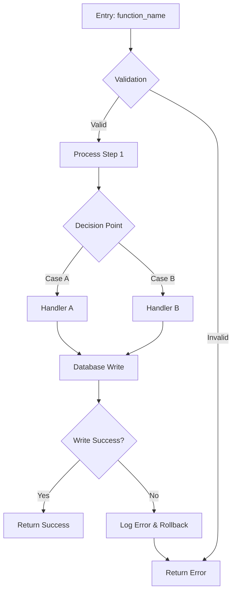
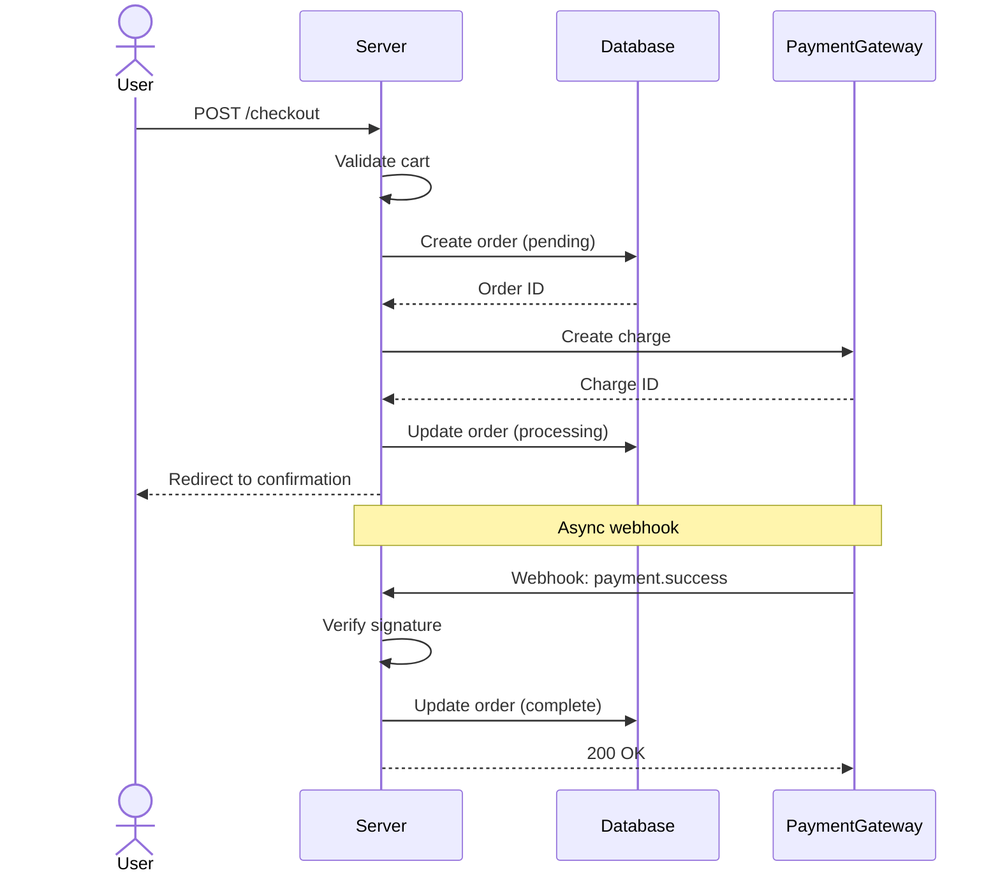
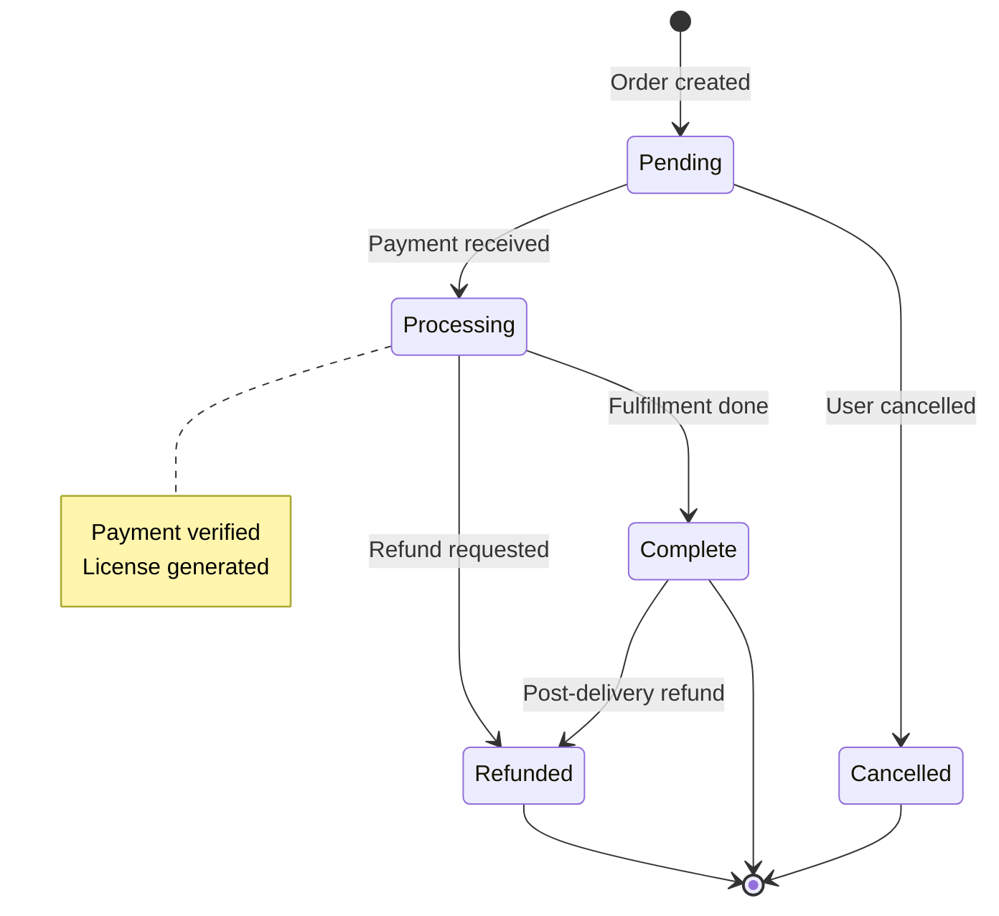

# Domain 12: Logic Diagrams

**Purpose:** Produce Mermaid diagrams for the most complex and critical code flows in the codebase (payment processing, authentication, data migration, webhook handling, etc.). This is a Level 2 domain — it uses Level 1 audit findings to identify which flows are most critical and most complex, then generates accurate diagrams by reading the actual code.

**Domain slug:** `logic-diagrams`
**ID prefix:** `logic-diagrams-NNN`
**Level:** 2 (receives Level 1 findings as input)

---

## Applicability

Always applicable. Every codebase has critical flows worth diagramming. More valuable for larger codebases with complex business logic.

---

## Input: Level 1 Findings

You receive all Level 1 findings as a JSON array in the `L1_FINDINGS` variable. Use them to:
- Identify the most complex functions and files (from `code-quality`, `architecture` domains)
- Find critical paths (from `security`, `test-coverage` domains) that handle sensitive operations
- Discover integration points (from `performance`, `architecture` domains) where flows cross system boundaries
- Prioritize which flows to diagram based on L1 severity and importance

---

## Check 1: Identify Critical Flows to Diagram

**Multi-pass approach:**
1. REVIEW: Scan L1 findings for references to complex, critical, or high-risk code paths
2. DISCOVER: Search the codebase for entry points of critical flows using keyword patterns
3. READ: Read the entry point files to understand the flow's scope and boundaries
4. ANALYZE: Rank flows by criticality (security impact, user impact, complexity) and select the top 5-8 for diagramming

### Flow discovery patterns

**Payment/checkout flows:**
```
(?:process_payment|charge|checkout|create_order|handle_payment|payment_complete|process_renewal)
```

**Authentication flows:**
```
(?:authenticate|login|logout|register|verify_token|validate_session|password_reset|oauth_callback)
```

**Webhook/callback flows:**
```
(?:handle_webhook|webhook_handler|process_callback|ipn_handler|notification_handler)
```

**Data migration flows:**
```
(?:migrate|migration|import_data|export_data|sync_data|transform_data)
```

**Subscription/renewal flows:**
```
(?:process_renewal|cancel_subscription|upgrade|downgrade|subscription_status|recurring_payment)
```

**API request lifecycle:**
```
(?:register_rest_route|add_action.*wp_ajax|router\.\w+|app\.\w+\s*\()
```

### Selection criteria
Prioritize flows that are:
1. **Security-sensitive**: Handles authentication, authorization, payment, or personal data
2. **Complex**: Spans multiple files/classes, has many decision points
3. **Flagged by L1**: Appeared in multiple L1 domain findings
4. **Business-critical**: Revenue-generating, user-facing, or data-integrity operations
5. **Integration-heavy**: Crosses system boundaries (API calls, webhooks, database transactions)

Select the top 5-8 flows. For each, record:
- Entry point file and function
- Why it was selected (L1 finding IDs, criticality reason)
- Estimated complexity (number of files involved, decision points)

### Severity
- Identification findings are informational: **low**, but set `important: true` for flows that are both complex and security-sensitive

---

## Check 2: Generate Flowchart Diagrams

**Multi-pass approach:**
1. READ: For each selected flow, read the entry point function in full
2. DISCOVER: Trace function calls to identify all files and functions involved in the flow
3. READ: Read each called function to understand the complete flow path including error handling
4. ANALYZE: Map out all decision points, branches, error paths, and outcomes
5. RESEARCH: WebSearch "mermaid flowchart syntax" to ensure correct diagram syntax

### Diagram generation process

For each critical flow, trace the execution path:

1. **Start at the entry point** (e.g., a route handler, webhook listener, or CLI command)
2. **Follow every function call** — read each called function to understand what it does
3. **Map decision points** — every `if`, `switch`, `try/catch` creates a branch
4. **Track data flow** — note what data is passed between functions and transformed
5. **Identify outcomes** — success paths, error paths, edge cases, early returns

### Flowchart template



### Rules for diagram accuracy
- **Every node must correspond to actual code** — do not diagram hypothetical behavior
- **Decision labels must match actual conditions** — use the real variable names and comparisons
- **Error paths must be included** — show what happens on failure, not just the happy path
- **External calls must be marked** — database writes, API calls, file operations should be visually distinct
- **Keep diagrams focused** — if a flow spans >20 nodes, split into sub-diagrams

### Evidence format
The `evidence` field in the finding JSON MUST contain the complete Mermaid diagram code. Example:
```json
{
  "evidence": "```mermaid\nflowchart TD\n    A[handle_webhook] --> B{Validate Signature}\n    B -->|Valid| C[Parse Payload]\n    B -->|Invalid| D[Return 401]\n    C --> E{Event Type}\n    E -->|order.success| F[process_order]\n    E -->|order.refund| G[process_refund]\n    E -->|unknown| H[Log & Return 200]\n```"
}
```

### Severity
- All flowchart diagrams: **low** (advisory/documentation)
- Set `important: true` for flows that are security-sensitive or revenue-critical

---

## Check 3: Generate Sequence Diagrams

**Multi-pass approach:**
1. READ: For flows that involve multiple actors (user, server, database, external API), read all interaction points
2. DISCOVER: Identify all external systems the flow communicates with
3. ANALYZE: Map the chronological sequence of interactions between actors
4. RESEARCH: WebSearch "mermaid sequence diagram syntax" to ensure correct syntax

### When to use sequence diagrams
Sequence diagrams are better than flowcharts when:
- Multiple systems/services interact (server <-> database <-> external API)
- The order of operations matters (payment flow: user -> server -> gateway -> webhook)
- Authentication handshakes occur (OAuth flows, token exchange)
- Webhook lifecycles need to be understood (request -> processing -> callback)

### Sequence diagram template



### Rules for sequence diagrams
- **Actors must be real system components** — use actual service/class names from the code
- **Messages must reflect actual function calls or HTTP requests** — use real method names
- **Include error paths** — use `alt/else` blocks for conditional responses
- **Note async operations** — mark webhooks, background jobs, and event-driven flows
- **Show database interactions** — include reads and writes separately

### Evidence format
Same as Check 2 — the `evidence` field contains the complete Mermaid diagram code.

### Severity
- All sequence diagrams: **low** (advisory/documentation)
- Set `important: true` for flows involving payment, authentication, or external API integration

---

## Check 4: Generate State Diagrams

**Multi-pass approach:**
1. REVIEW: Check L1 findings for mentions of state management, status fields, or lifecycle management
2. DISCOVER: Search for status/state fields in database schemas, models, or constants
3. READ: Read the code that transitions between states to understand all valid transitions
4. ANALYZE: Map the complete state machine including guard conditions and error states
5. RESEARCH: WebSearch "mermaid state diagram syntax" for correct syntax

### When to use state diagrams
State diagrams are appropriate when:
- An entity has a `status` or `state` field with defined transitions
- Order lifecycle (pending -> processing -> complete -> refunded)
- Subscription lifecycle (trial -> active -> past_due -> cancelled)
- User account states (pending -> active -> suspended -> deleted)
- Migration/job states (queued -> running -> completed -> failed)

### State discovery patterns

**Database status columns:**
```
(?:status|state|lifecycle|phase)\s*(?:=|:)\s*['"](\w+)['"]
```

**Status constants/enums:**
```
(?:STATUS_|STATE_|PHASE_)\w+\s*[:=]\s*['"](\w+)['"]
```

**WordPress post status:**
```
post_status\s*(?:=|=>)\s*['"](\w+)['"]
```

**EDD/WooCommerce order status:**
```
(?:order_status|edd_get_payment_status|update_status)\s*\(.*['"](\w+)['"]
```

### State diagram template



### Rules for state diagrams
- **States must come from actual code** — use the real status values from constants or database
- **Transitions must correspond to actual code paths** — read the functions that change status
- **Guard conditions should be noted** — what must be true for a transition to occur
- **Invalid/impossible transitions should be checked** — if the code allows a transition that shouldn't happen, note it as a finding

### Evidence format
Same as Checks 2 and 3 — complete Mermaid diagram code in the `evidence` field.

### Severity
- All state diagrams: **low** (advisory/documentation)
- Set `important: true` for entity lifecycles that handle money or user access

---

## Check 5: Complexity Warnings

**Multi-pass approach:**
1. REVIEW: Check L1 findings for the most complex functions and files
2. READ: Read flows that are too complex to diagram cleanly (>30 nodes would be needed)
3. ANALYZE: Determine if the complexity itself is a finding — code too complex to diagram is code too complex to maintain
4. RESEARCH: WebSearch "refactoring complex code flows" for strategies

### When a flow is too complex to diagram

If while tracing a flow for diagramming you find:
- The flow spans >10 files with deeply interleaved calls
- There are >6 levels of conditional nesting within the flow
- The flow has >30 distinct decision points
- Multiple flows are entangled (impossible to diagram one without including another)
- Recursive or circular call patterns make the flow hard to represent linearly

This is itself a significant finding. Code that cannot be diagrammed cannot be easily understood, tested, or maintained.

### What to report
For each flow that is too complex to diagram:
1. Identify the entry point and the approximate scope
2. Explain WHY it's too complex (too many branches, too many files, circular calls)
3. Suggest how to simplify (extract sub-flows, reduce branching, separate concerns)
4. Note which L1 findings relate to this complexity

### Severity
- Flow too complex to diagram clearly: **medium** (indicates need for refactoring)
- Flow too complex AND flagged in L1 security or test coverage: **medium**, `important: true`
- Flow that would require 50+ nodes: **high** (seriously needs decomposition)

---

## Output Reminder

Return findings as JSON array. Use `"domain": "logic-diagrams"` and IDs like `logic-diagrams-001`. Categories: `flow-diagram`, `sequence-diagram`, `state-diagram`, `complexity-warning`.

**Special note on evidence:** For diagram findings (Categories: `flow-diagram`, `sequence-diagram`, `state-diagram`), the `evidence` field MUST contain the complete Mermaid diagram code wrapped in a mermaid code block. This is the primary deliverable of this domain — the diagrams themselves.
