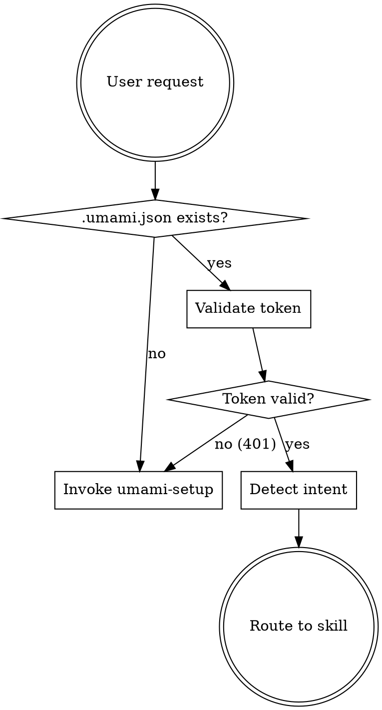

# Umami Analytics Hub

Entry point for all Umami Analytics operations. Routes to the right sub-skill based on what the user needs.

## Routing Flow



## Step 1: Check Config

Read `.umami.json` from the project root. It must contain:
- `host` — Umami instance URL
- `websiteId` — target website UUID
- `token` — JWT auth token

If missing or malformed → invoke `bvdr:umami-setup`.

## Step 2: Validate Token

Quick health check — verify the token is still valid:

```bash
curl -s -X POST "{host}/api/auth/verify" \
  -H "Authorization: Bearer {token}"
```

- Success → proceed to routing
- 401 → token expired, invoke `bvdr:umami-setup` with "Refresh token" option
- Connection error → warn user, suggest checking if instance is running

## Step 3: Route by Intent

| User says something like... | Invoke skill |
|---|---|
| "set up umami", "connect", "install tracker", "configure" | `bvdr:umami-setup` |
| "track", "add event", "identify users", "implement tracking", "data attributes", "revenue tracking", "server-side event", "what should I track" | `bvdr:umami-track` |
| "funnel", "journey", "retention", "goal", "UTM", "attribution", "breakdown", "revenue report", "create report" | `bvdr:umami-reports` |
| "stats", "metrics", "how many visitors", "show pageviews", "sessions", "realtime", "query", "event data", "active users" | `bvdr:umami-query` |

If intent is ambiguous, ask the user:
> What would you like to do with Umami?
> - Set up or reconfigure the connection
> - Implement tracking in your code
> - Create or run reports (funnels, journeys, goals, etc.)
> - Query stats and data

## Important

This skill does NO implementation work. It only:
1. Validates the config/connection
2. Routes to the appropriate sub-skill

Never attempt to handle tracking, reports, or queries directly.

## Notes

- Self-hosted Umami JWT tokens do not expire by default, but instance admins can configure expiry
- Never display the full token in output — truncate to first 10 characters + `...`
- If the website returns 404, the website ID may have been deleted — route to `bvdr:umami-setup`
